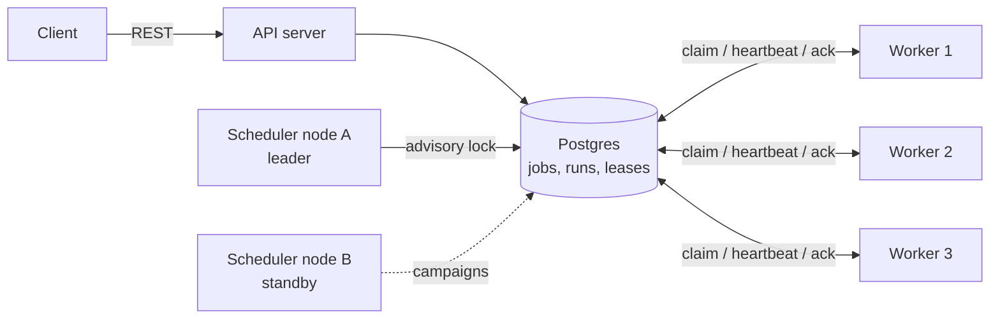
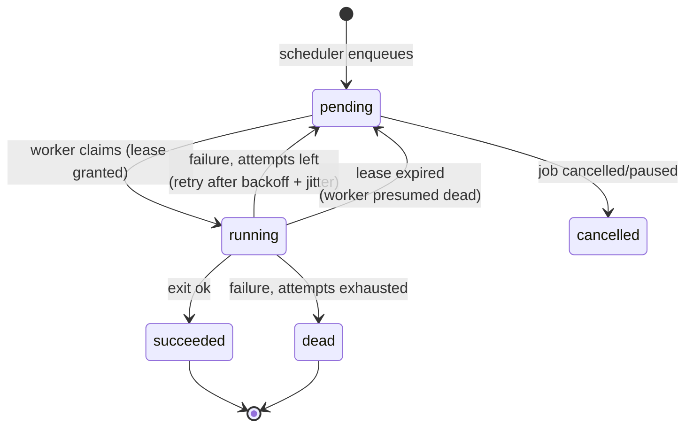

# ForgeFlow

A distributed job scheduler written in Go. Think `cron`, but across a fleet of machines: submit jobs through a REST API, let any number of worker nodes execute them, and get durability, retries, and crash recovery for free.

```
Submit a job once. ForgeFlow makes sure it runs — on time, exactly one worker
at a time, retried on failure, and recovered if that worker dies mid-flight.
```

## Why

A single `cron` on a single box has three fatal flaws: it is a single point of failure, it cannot scale past one machine, and it offers no retries, no history, and no answer to "did it actually run?". Every serious backend eventually rebuilds this infrastructure for billing runs, report generation, digests, and pipeline kicks. ForgeFlow is that infrastructure as a standalone system.

## Features

- **REST API** for job management: one-off jobs, recurring cron jobs (with timezone support), immediate runs, manual triggers
- **Horizontally scalable workers** — add or kill worker nodes freely; work distributes automatically
- **Exactly-once-ish execution** — a run is executed by exactly one worker at a time, enforced by atomic claims in Postgres
- **Crash recovery** — leases with heartbeats; a dead worker's runs are re-queued automatically
- **Retries** — exponential backoff with full jitter, dead-letter state after max attempts
- **Highly available scheduler** — leader election via Postgres advisory locks; any node can take over
- **Idempotent submission** — the same idempotency key never creates a duplicate job
- **Priorities, timeouts, pause/resume/cancel, catch-up policies** for missed cron ticks
- **Observability** — full run history, live dashboard, Prometheus metrics, structured logs
- **Graceful shutdown** — SIGTERM drains in-flight runs before exit

## Architecture



One binary, three roles, any combination per node:

| Role | Responsibility |
|------|----------------|
| `api` | REST API, dashboard, metrics |
| `scheduler` | Turns schedules into due runs. Runs on every node; only the advisory-lock leader acts |
| `worker` | Claims due runs, executes them, heartbeats its leases |

Postgres is the single source of truth — there is no message broker and no coordination service to operate. This is a deliberate trade-off: the claim pattern below scales comfortably to thousands of runs per second, which covers the real use cases of a job scheduler, in exchange for a system with exactly one stateful dependency.

### The claim engine

The core problem of any distributed queue: many workers, one run, no double execution, no lost work. ForgeFlow solves it with one atomic statement:

```sql
WITH claimed AS (
    SELECT r.id FROM runs r
    WHERE r.status = 'pending' AND r.scheduled_for <= now()
    ORDER BY r.priority, r.scheduled_for
    LIMIT $n
    FOR UPDATE SKIP LOCKED        -- contended rows are skipped, not waited on
)
UPDATE runs SET status = 'running',
                worker_id = $me,
                attempt = attempt + 1,
                lease_expires = now() + $lease
FROM claimed WHERE runs.id = claimed.id
RETURNING ...
```

`FOR UPDATE SKIP LOCKED` lets an arbitrary number of workers poll the same queue without blocking each other — the same mechanism used in production by River and Oban. The `pending → running` row transition is the mutual exclusion: exactly one worker wins each run.

### Run lifecycle



### Failure handling, precisely

**Worker crashes mid-run.** Every claim carries a lease (default 30s) that the worker extends by heartbeat (default every 10s). If heartbeats stop, the lease expires and any node's recovery loop returns the run to `pending` — counted as a failed attempt, so a job that *causes* workers to crash still dead-letters instead of crash-looping forever.

**Worker is slow, not dead.** The nasty race: worker A's lease expires, the run is handed to worker B, then A finishes anyway. Every state-changing update is guarded by `WHERE worker_id = $me AND status = 'running'` — A's late write updates zero rows and is discarded. This is verified by a dedicated integration test (`TestSlowWorkerCannotOverwriteNewOwner`).

**Scheduler node dies.** Leadership is a Postgres session-level advisory lock. If the leader's connection drops — process crash, network partition, anything — Postgres releases the lock and a standby node acquires it on its next campaign (within ~5s). Enqueueing a run and advancing the job's clock happen in one transaction guarded by the previous `next_run_at` value, so a leader handover can never double-fire a tick.

**Transient job failures.** Retries are scheduled with exponential backoff (5s, 10s, 20s, ... capped at 15m) plus full jitter, so a downstream outage doesn't produce a thundering herd of simultaneous retries.

**What "exactly-once-ish" means.** ForgeFlow guarantees at-least-once execution with single-owner semantics: exactly one worker holds a run at a time, but a worker that crashes *after* the job's side effect and *before* the ack will cause a re-run. True exactly-once side effects are impossible in a distributed system without cooperation from the side effect itself; make handlers idempotent.

## Quick start

```bash
docker compose up --build
```

That starts Postgres, one API + scheduler node, and three workers. Open http://localhost:8080 for the live dashboard, then submit jobs:

```bash
# Run immediately
curl -X POST localhost:8080/api/jobs -d '{
  "name": "hello",
  "executor": "shell",
  "payload": {"command": "echo hello from forgeflow"}
}'

# Every 5 minutes, in a specific timezone
curl -X POST localhost:8080/api/jobs -d '{
  "name": "report",
  "executor": "shell",
  "cron_expr": "*/5 * * * *",
  "timezone": "Asia/Kolkata",
  "payload": {"command": "date"}
}'

# Webhook job with retries
curl -X POST localhost:8080/api/jobs -d '{
  "name": "notify",
  "executor": "http",
  "max_attempts": 5,
  "payload": {"url": "https://example.com/hook", "body": {"event": "ping"}}
}'

# Idempotent submission: safe to call twice, creates one job
curl -X POST localhost:8080/api/jobs -d '{
  "name": "billing-july",
  "idempotency_key": "billing-2026-07",
  "executor": "shell",
  "payload": {"command": "run-billing"}
}'
```

### The chaos test

Prove the recovery story to yourself:

```bash
# submit a slow job, then kill the worker that claimed it
curl -X POST localhost:8080/api/jobs -d '{
  "name": "slow",
  "executor": "shell",
  "timeout_seconds": 120,
  "payload": {"command": "sleep 60 && echo survived"}
}'
make chaos            # kills worker-2
```

Watch the dashboard: within one lease period the orphaned run flips back to `pending`, another worker claims it, and it completes. Nothing is lost.

## API

| Method | Path | Purpose |
|--------|------|---------|
| POST | `/api/jobs` | Create a job |
| GET | `/api/jobs` | List jobs |
| GET | `/api/jobs/{id}` | Get one job |
| POST | `/api/jobs/{id}/pause` | Pause (pending runs cancelled) |
| POST | `/api/jobs/{id}/resume` | Resume |
| POST | `/api/jobs/{id}/cancel` | Cancel permanently |
| POST | `/api/jobs/{id}/trigger` | Enqueue a run right now |
| GET | `/api/runs?job_id=&limit=` | Run history |
| GET | `/api/runs/{id}` | One run with output/error |
| GET | `/api/stats` | Run counts by status |
| GET | `/metrics` | Prometheus metrics |
| GET | `/healthz` | Liveness |

Job fields: `name` (required), `executor` (`shell` or `http`, required), `payload`, `cron_expr` or `run_at` (neither = run now), `timezone` (default UTC), `priority` (1–9, 1 highest), `max_attempts` (default 3), `timeout_seconds` (default 300), `catch_up` (`skip` or `once` — what to do with cron ticks missed during downtime), `idempotency_key`.

## Configuration

All via environment variables:

| Variable | Default | Meaning |
|----------|---------|---------|
| `FORGEFLOW_DATABASE_URL` | localhost dev DSN | Postgres connection string |
| `FORGEFLOW_LISTEN_ADDR` | `:8080` | API listen address |
| `FORGEFLOW_WORKER_ID` | hostname-pid | Node identity in claims/leases |
| `FORGEFLOW_CONCURRENCY` | `8` | Parallel runs per worker |
| `FORGEFLOW_POLL_INTERVAL` | `1s` | Queue poll frequency |
| `FORGEFLOW_LEASE_DURATION` | `30s` | Lease length; crash detection horizon |
| `FORGEFLOW_HEARTBEAT_INTERVAL` | `10s` | Lease extension frequency |
| `FORGEFLOW_SCHEDULER_TICK` | `1s` | Leader's scheduling resolution |

## Development

```bash
make test               # unit tests (race detector)
make test-integration   # + Postgres integration tests (needs docker compose up -d postgres)
make run                # single all-in-one node against local Postgres
```

The integration suite covers the parts that matter: 10 workers racing over a queue with zero double-claims, lease recovery after worker death, the slow-worker/zombie-write race, retry-then-dead-letter progression, and idempotent creation. CI runs the full suite with the race detector against a real Postgres on every push.

## Project layout

```
cmd/forgeflow/       entrypoint; role selection (api / scheduler / worker)
internal/api/        HTTP handlers, dashboard
internal/scheduler/  cron parsing, leader election loop, tick logic
internal/worker/     claim-execute loop, heartbeats, recovery, graceful drain
internal/executor/   shell and http payload executors
internal/store/      Postgres layer: claims, leases, leadership, migrations
internal/backoff/    exponential backoff with full jitter
```

## License

MIT
